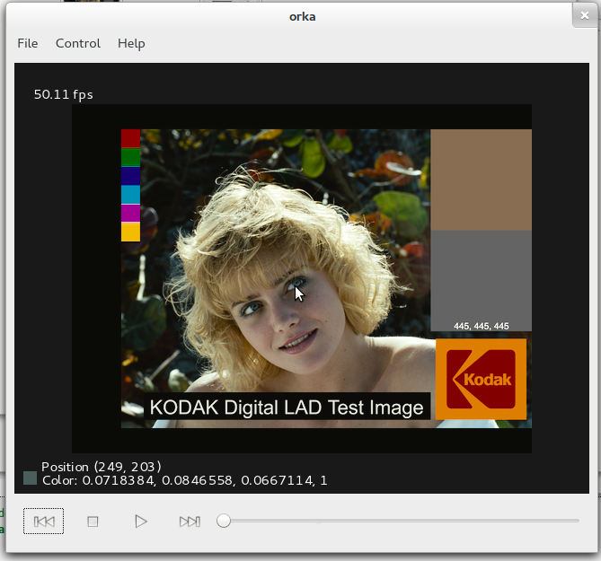

orka
====

Linux image viewer/player with support for many image and movie formats through the use of the OpenImageIO and libvlc libraries.
Feature highlights:
- Configurable color space support through [OpenColorIO](http://opencolorio.org/).
- Color corrections/LUT applied in an GLSL shader.
- Support for many file formats through [OpenImageIO](http://openimageio.org/).
- Floating point/HDR image support.
- Support for playing video throught the vlc library.
- Multithreaded, able to playback 2k resolution images in real-time on a powerful computer.
- More to come!



TODO
====
- [ ] Bugfixes related to the time-slider.
- [ ] Create settings window for gamma control, exposure, LUT and any other image settings we can think of.
- [ ] Be able to control size of image cache. Currently at 200 MB.
- [ ] Support viewing AOV-channels in images.
- [x] Create commands to reset viewport to different sizes (1-to-1 pixel, adjust to screen size, double size, half size etc)
- [x] Support opencolorio
- [x] Create control bar widget at the bottom, play pause stop, time/frame-slider etc.

Test Images
====
I ran the following to download a few hundred frames from Big Buck Bunny (http://www.bigbuckbunny.org/) to the current folder:
```
for frame in `seq 379 553`; do 
wget http://media.xiph.org/BBB/BBB-1080-png/big_buck_bunny_00$frame.png; 
done
```

Test movies
====
Just download any mpeg or other movie file to test it, libvlc should support most of them.

Dependencies
====
Currently these are the dependencies:
- OpenImageIO - 1.2.0
- OpenColorIO - 1.0.8
- libvlc - 2.0.8
- Qt5

They can be installed on a debian-like system by running
apt-get install libopenimageio-dev libvlc-dev
and
doing a google search on how to install qt5.

In the future opencolorio might become a dependency. 

Style
====
Try to follow the Google C++ style guide here:
http://google-styleguide.googlecode.com/svn/trunk/cppguide.xml
